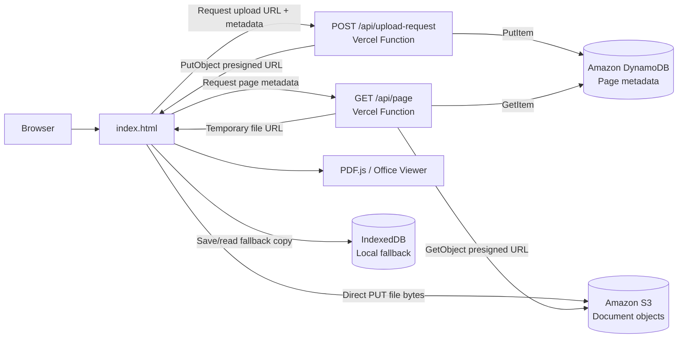

# DONTCBOARD

> Publish PDFs and PowerPoint files to a memorable page name and share them through a clean, browser-based viewer.

DONTCBOARD is a small full-stack document publishing application built around an AWS serverless storage pattern. The browser handles the user experience, the API creates short-lived signed URLs, Amazon S3 stores document bytes, and Amazon DynamoDB stores the lookup metadata needed to find each document.

This project is also a practical first AWS cloud integration: it keeps the infrastructure understandable while using the same design principles used by larger cloud applications: least-privilege access, direct-to-object-storage uploads, durable metadata, and stateless API endpoints.

## Features

- Upload PDF, PPT, and PPTX files up to 10 MB.
- Choose a URL-friendly page name such as `quarterly-report`.
- Upload files directly from the browser to Amazon S3 with a presigned URL.
- Store page metadata in Amazon DynamoDB.
- Generate temporary, presigned download URLs when a page is viewed.
- Render PDFs with PDF.js and PowerPoint files through an embedded online viewer.
- Keep a browser-local IndexedDB copy as a fallback when cloud access is unavailable.
- Deploy as a static frontend plus serverless API routes on Vercel.
- Run locally with a small Node.js HTTP server.

## AWS Architecture



### Why this architecture?

The API does not proxy a 10 MB file through the serverless function. Instead, it authorizes the upload and returns a short-lived S3 URL; the browser sends the file directly to S3. This reduces API bandwidth, keeps the API stateless, and makes the storage boundary explicit.

DynamoDB acts as the page directory. A page name is the partition key, so looking up `/quarterly-report` is a direct, single-item read rather than a scan.

## Upload Flow

1. The user selects a supported file and enters a page name.
2. The browser sends file metadata to `POST /api/upload-request`.
3. The API normalizes the page name and validates the extension and 10 MB limit.
4. The API creates an S3 object key such as `uploads/quarterly-report-<timestamp>.pdf`.
5. The API returns a presigned S3 `PUT` URL that expires after 15 minutes.
6. The API writes the page metadata to DynamoDB.
7. The browser uploads the file directly to S3.
8. The browser saves a local IndexedDB copy and navigates to the page.

## View Flow

1. The browser requests `GET /api/page?name=quarterly-report`.
2. The API reads the item with `pageName` as the DynamoDB key.
3. If the item exists, the API creates a presigned S3 `GET` URL valid for one hour.
4. The browser renders the returned file URL with PDF.js or the PowerPoint viewer.
5. If the cloud request is unavailable, the browser checks its local IndexedDB fallback.

## Data Model

### DynamoDB table: `easywritedown-pages`

| Attribute | Type | Purpose |
| --- | --- | --- |
| `pageName` | String | Partition key and public page slug |
| `fileName` | String | Original uploaded file name |
| `fileType` | String | `pdf`, `ppt`, or `pptx` |
| `fileSize` | Number | File size in bytes |
| `s3Key` | String | Private object key in S3 |
| `contentType` | String | MIME type sent to S3 |
| `createdAt` | String | ISO 8601 publication timestamp |

No sort key is required for the current one-document-per-page model. Publishing the same page name replaces its DynamoDB metadata with a new object key.

## AWS Setup

### 1. Create the S3 bucket

Create a private S3 bucket in the region you plan to use. Keep **Block all public access** enabled. DONTCBOARD uses presigned URLs, so the bucket does not need to be public.

Use a globally unique bucket name, for example:

```text
easywritedown-files-your-unique-id
```

Add CORS so the browser can make the presigned `PUT` request. Replace the origin with your real domain before production:

```json
[
  {
    "AllowedOrigins": ["http://localhost:3000", "https://dontcboard.me"],
    "AllowedMethods": ["PUT", "GET", "HEAD"],
    "AllowedHeaders": ["Content-Type"],
    "ExposeHeaders": ["ETag"],
    "MaxAgeSeconds": 3000
  }
]
```

### 2. Create the DynamoDB table

Create a table with:

- Table name: `easywritedown-pages`
- Partition key: `pageName`
- Partition key type: `String`
- Billing mode: `On-demand`

On-demand billing is a straightforward starting point for a small or unpredictable workload. Review the AWS pricing for your region before going live.

### 3. Create an IAM identity for the API

The API needs to generate S3 presigned URLs and read/write DynamoDB metadata. A focused policy is better than granting administrator access. Replace the placeholders with your AWS account, bucket, and table values:

```json
{
  "Version": "2012-10-17",
  "Statement": [
    {
      "Sid": "DocumentBucketAccess",
      "Effect": "Allow",
      "Action": [
        "s3:PutObject",
        "s3:GetObject"
      ],
      "Resource": "arn:aws:s3:::YOUR_BUCKET_NAME/uploads/*"
    },
    {
      "Sid": "PageMetadataAccess",
      "Effect": "Allow",
      "Action": [
        "dynamodb:GetItem",
        "dynamodb:PutItem"
      ],
      "Resource": "arn:aws:dynamodb:YOUR_AWS_REGION:YOUR_ACCOUNT_ID:table/easywritedown-pages"
    }
  ]
}
```

For Vercel, prefer an IAM user or role credential mechanism supported by your deployment setup, and store credentials only as encrypted project environment variables. Never commit access keys to Git.

## Environment Variables

Copy `.env.example` to `.env` for local development and fill in real values:

```env
AWS_REGION=us-east-1
S3_BUCKET=your-private-bucket-name
DYNAMODB_TABLE=easywritedown-pages
AWS_ACCESS_KEY_ID=your_access_key_id
AWS_SECRET_ACCESS_KEY=your_secret_access_key
```

The AWS SDK automatically reads these variables. Do not add `.env` to source control; it is already ignored by `.gitignore`.

## Run Locally

Prerequisites:

- Node.js 18 or newer
- An AWS account
- The S3 bucket and DynamoDB table created above
- AWS credentials with the focused permissions above

Install dependencies and start the local server:

```bash
npm install
npm run dev
```

Open [http://localhost:3000](http://localhost:3000).

The local server serves `index.html` and forwards `/api/page` and `/api/upload-request` to the same handlers used by the deployment. Your local browser origin must be included in the S3 CORS configuration.

## Deploy to Vercel

1. Import this repository into Vercel.
2. Add the following Project Environment Variables:
    - `SITE_URL=https://dontcboard.me`
   - `AWS_REGION`
   - `S3_BUCKET`
   - `DYNAMODB_TABLE`
   - `AWS_ACCESS_KEY_ID`
   - `AWS_SECRET_ACCESS_KEY`
3. Deploy the project.
4. Add the deployed Vercel origin to the S3 bucket CORS `AllowedOrigins` list.
5. Upload a small PDF and verify that its page opens in a new browser session.

After deployment, verify `https://dontcboard.me/robots.txt` and
`https://dontcboard.me/sitemap.xml` in a browser. In Google Search Console,
add the site property and submit `sitemap.xml`. The sitemap currently lists the
homepage, while document pages are created dynamically and are not enumerated
until a public page directory exists.

`vercel.json` routes API requests to the files in `api/` and rewrites document paths back to the frontend so a page such as `/quarterly-report` can load directly.

## API Reference

### `POST /api/upload-request`

Creates a presigned S3 upload URL and writes the page metadata record.

Request body:

```json
{
  "pageName": "quarterly-report",
  "fileName": "quarterly-report.pdf",
  "fileType": "pdf",
  "fileSize": 245760,
  "contentType": "application/pdf"
}
```

Successful response includes:

```json
{
  "success": true,
  "pageName": "quarterly-report",
  "uploadUrl": "https://...",
  "s3Key": "uploads/quarterly-report-...pdf"
}
```

### `GET /api/page?name=<page-name>`

Returns page metadata and a temporary S3 download URL when the page exists:

```json
{
  "exists": true,
  "pageName": "quarterly-report",
  "fileUrl": "https://...",
  "fileName": "quarterly-report.pdf",
  "fileType": "pdf",
  "fileSize": 245760,
  "createdAt": "2026-09-04T12:00:00.000Z"
}
```

## Project Structure

```text
.
├── index.html              # Frontend, viewer, IndexedDB fallback, and API client
├── api/
│   ├── upload-request.js   # Validates metadata, presigns S3 PUT, writes DynamoDB
│   └── page.js             # Reads DynamoDB and presigns S3 GET
├── server.js               # Local Node.js server and API router
├── vercel.json             # Vercel rewrites for API routes and page paths
├── .env.example            # AWS environment variable template
└── package.json             # Node.js scripts and AWS SDK dependencies
```

## Security and Production Notes

- Keep the S3 bucket private; do not use public-read bucket policies.
- Keep presigned URL lifetimes short. Upload URLs are currently 15 minutes and viewer URLs are currently 1 hour.
- Scope IAM permissions to the required bucket prefix and DynamoDB table.
- Restrict S3 CORS origins to known domains instead of `*`.
- Do not commit `.env`, access keys, or downloaded AWS credentials.
- Treat page names as public identifiers. Anyone with a page URL may be able to view the published document.
- Add authentication and authorization before using this for private documents.
- Add rate limiting, malware scanning, quotas, and abuse monitoring before accepting untrusted public uploads at scale.
- Consider moving the DynamoDB write until after the S3 upload succeeds, or adding cleanup/reconciliation, so a failed upload cannot leave metadata pointing at a missing object.
- Add a deletion workflow if users need to remove both the DynamoDB record and the S3 object.
- Review AWS CloudTrail, S3 lifecycle rules, DynamoDB costs, and retention requirements before production use.

## Troubleshooting

### `Network error during S3 file upload`

Check that:

- The S3 bucket CORS configuration includes the exact browser origin.
- The `Content-Type` used by the browser matches the content type used when the presigned URL was generated.
- The presigned URL has not expired.
- The API credentials can call `s3:PutObject` on the `uploads/*` prefix.

### The page says no document was found

Check that:

- `DYNAMODB_TABLE` matches the deployed table name.
- The API credentials can call `dynamodb:GetItem`.
- The upload request completed successfully.
- The `pageName` is normalized to the slug you are opening.

### AWS credentials are rejected

Check the region, access key, secret key, IAM permissions, and deployment environment. For local work, confirm that `.env` is present and that the process was restarted after changing it.

## License

No license has been declared yet. Add a license before distributing or accepting external contributions.
